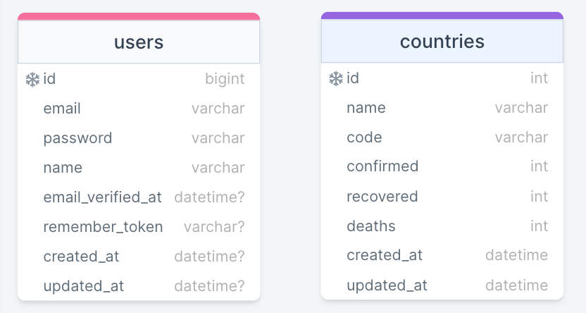

<div style="display:flex; align-items: center">
  <h1 style="position:relative; top: -6px" >Coronatime</h1>
</div>

---
Coronatime - is a platform where users can register, go through authorization (as well as restore the password if they have forgotten it) and see what the situation is today in the countries of the world by seeing recovered, new cases, and deaths statistics.

#
### Table of Contents
* [Prerequisites](#prerequisites)
* [Tech Stack](#tech-stack)
* [Getting Started](#getting-started)
* [Migrations](#migration)
* [Tests](#tests)
* [Development](#development)
* [DrawSQLDiagram](#database-diagram)

#
### Prerequisites

*  *PHP*
*  *npm*
*  *composer*

#
### Tech Stack

*  https://laravel.com/ - back-end framework
*  https://tailwindcss.com/ - front-end framework

#
### Getting Started
1. First of all you need to clone repository from github:
```sh
git clone https://github.com/RedberryInternship/aleqsandre-mtchedlidze-corona-time.git
```

2. Next step requires you to run *composer install* in order to install all the dependencies.
```sh
composer install
```

3. after you have installed all the PHP dependencies, it's time to install all the JS dependencies:
```sh
npm install
```

and also:
```sh
npm run dev
```
in order to build your JS/SaaS resources.

after setting up, execute:
```sh
php artisan app:fetch-data-command
```
in order to fetch countries data from an api and fill in dashboard pages with an information to interact with

##### Now, you should be good to go!


#
### Migration
if you've completed getting started section, then migrating database if fairly simple process, just execute:
```sh
php artisan migrate
```

#
### Tests
application has also tests of all kinds to ensure quality of operations. if you have installed XDebug (which comes with coverage tool) you can check it.
following command will run all tests 
```sh
php artisan test
```

#
### Development

You can run Laravel's built-in development server by executing:

```sh
php artisan serve
```

when working on JS you may run:

```sh
npm run dev
```
it builds your js files into executable scripts.
If you want to watch files during development, execute instead:

Then everything should be OK 🙏

#
### Database Diagram - <a href="https://drawsql.app/teams/redberry-36/diagrams/coronatime">DrawSQL Diagram Link</a>



#
### Production Server
Coronatime application is hosted on following <a href="https://corona-time.aleqsandre-mchedlidze.redberryinternship.ge/dashboard/worldwide">URL</a>
